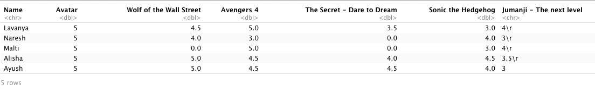
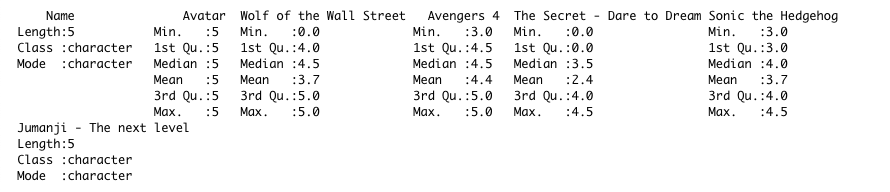

#### Creating CSV file
- A CSV file was created using Google Sheets
  - Link : [Google Sheet](https://docs.google.com/spreadsheets/d/18ak4byfqrXkBLOweYUkbEacYKbMiJ02OVxWaqHhGmpc/edit?usp=sharing)

#### Creating Survey
- A survey was created, connected with Google Sheets and was distributed with users
  - Link : [Google Forms](https://docs.google.com/forms/d/e/1FAIpQLSddvCEvHNJcVBralIbEUWJ4QsAtLKNgajqnASqqAYjhuiJ35g/viewform?usp=sf_link)

This way users was given option to choose CSV and survey both

---

- Next, the CSV was donwloaded from Google Sheets
  - CSV file location: `C:/User/arushi/Desktop/Assignment2/Movie_Ratings_Survey_(Responses) - Form Responses.csv`

---
- A MySQL 8.0 database was created on AWS with AWS RDS and connection was established with local computer
```
mysql -u root -h aws-movie-rating.cc7r4c0owv8u.us-east-1.rds.amazonaws.com -p 
```
  - Password entered

#### Code to create table along with databse
- Creating & using schema
  ```
  CREATE SCHEMA  IF NOT EXISTS `aws_movie_ratings` ;
  USE `aws_movie_ratings`;
  ```
- Creating table

  ```
  CREATE TABLE `movie_ratings` (
    `id` int NOT NULL AUTO_INCREMENT,
    `Datetime` DATETIME NULL,
    `Name` text,
    `Avatar` double DEFAULT NULL,
    `Wolf of the Wall Street` double DEFAULT NULL,
    `Avengers 4` double DEFAULT NULL,
    `The Secret - Dare to Dream` double DEFAULT NULL,
    `Sonic the Hedgehog` double DEFAULT NULL,
    `Jumanji - The next level` double DEFAULT NULL,
    PRIMARY KEY (`id`)
  ) ENGINE=InnoDB;
  ```

- Code for populating the tables from .csv file stored locally
```
LOAD DATA LOCAL INFILE "C://User//arushi//Desktop//movie_ratings.csv" INTO TABLE aws_movie_ratings.movie_ratings  
FIELDS TERMINATED BY ','
LINES TERMINATED BY '\n'
IGNORE 1 LINES
(`Datetime`,`Name`,`Avatar`,`Wolf of the Wall Street`,`Avengers 4`,`The Secret - Dare to Dream`,`Sonic the Hedgehog`,`Jumanji - The next level`);
```
  - Response:
  ```
  Query OK, 5 rows affected, 3 warnings (0.30 sec)
  Records: 5  Deleted: 0  Skipped: 0  Warnings: 3
  ```
---
#### Code in R Markdown to import DB data for analysis
```
```{r}
library(RMySQL)

mysqlconnection = dbConnect(MySQL(), user='root', password='db_password_here', dbname ='aws_movie_ratings',host='aws-movie-rating.cc7r4c0owv8u.us-east-1.rds.amazonaws.com')

result = dbSendQuery(mysqlconnection,"SELECT `Name`,`Avatar`,`Wolf of the Wall Street`,`Avengers 4`,`The Secret - Dare to Dream`,`Sonic the Hedgehog`,`Jumanji - The next level`  from movie_ratings")

data.frame=fetch(result)
ratings = data.frame
print(ratings)
```
- Output



#### Reproducibility
- Is data available on the web? (2)
  - Yes, [Google Sheet](https://docs.google.com/spreadsheets/d/18ak4byfqrXkBLOweYUkbEacYKbMiJ02OVxWaqHhGmpc/edit?usp=sharing)
  
- Are you using R Markdown text and headers?
  - Yes, please go througth the RMarkdown file, also available at [Assignment_2.Rmd](https://github.com/Araisedtotwo/Assignment2/Assignment_2.Rmd)

#### Analysis
- Yes, I would recommend `Avatar` the most because the mean value of ratings is highest for movie Avatar
```
``{r, echo=FALSE}
summary(ratings)
```
- Output



#### Submission
- rpubs link :  [657395](https://rpubs.com/Araisedtotwo/657395)
- assignment submission link :  [GitHub](https://github.com/Araisedtotwo/Assignment2)
- graphic : yes, tables included
